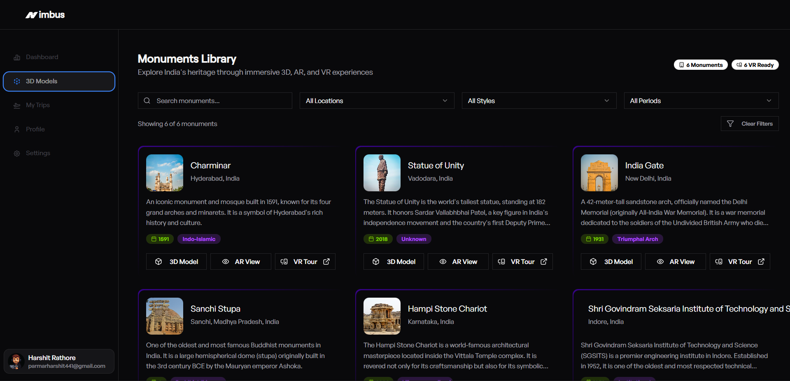
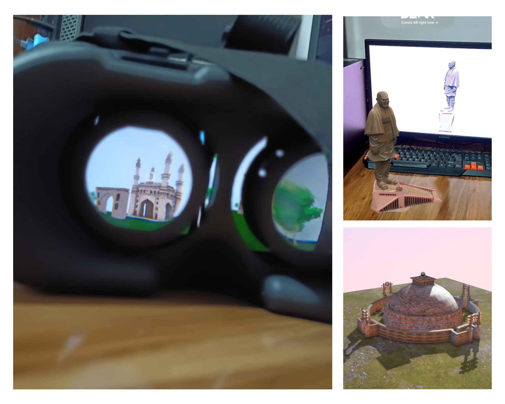
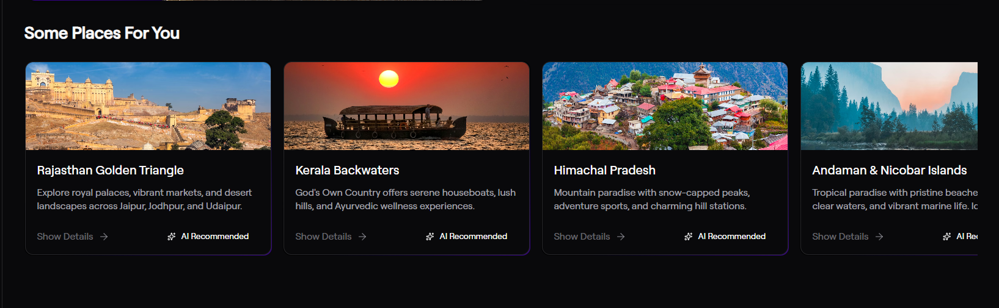
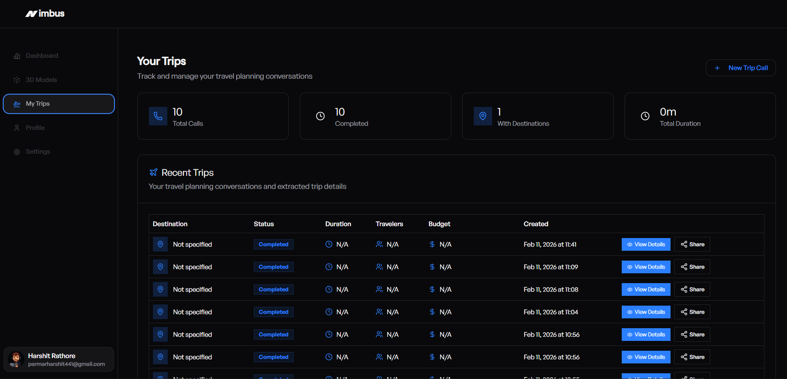

# Nimbus Landing Page

Welcome to the **Nimbus** repository!  
This project is a modern, interactive web platform designed to help users discover, explore, and plan trips to monuments and destinations using AI-powered recommendations, immersive 3D/AR/VR experiences, and collaborative trip planning tools.

---

## Technologies Used

- **React** (with Hooks)
- **Tailwind CSS** (for styling and gradients)
- **Lucide Icons** (for beautiful iconography)
- **React Router** (for navigation)
- **Sonner** (for notifications)
- **Date-fns** (for date formatting)
- **Git Submodules** (for modular code organization)
- **Custom UI Components** (Badge, Button, Table, etc.)
- **AI Integration** (for recommendations)
- **3D/AR/VR Support** (for monument exploration)

---

## Features

### 1. Monument Discovery & Filtering

Explore a curated list of monuments with advanced filtering by location, architecture, and historical period.  
**Space for image:**  


---

### 2. 3D, AR & VR Experiences

View monuments in interactive 3D, AR, and VR modes for immersive exploration.  
**Space for image:**  


---

### 3. AI-Powered Recommendations

Get personalized travel suggestions based on your interests, preferences, and past trips.  
**Space for image:**  


---

### 4. Trip Planning & Recent Trips

Plan new trips, view recent trips, and collaborate with friends.  
**Space for image:**  


---

## Problems Solved

- **Complex Monument Exploration:**  
  Users can easily discover and learn about monuments with rich media and immersive technology.

- **Personalized Travel Planning:**  
  AI recommendations ensure users get suggestions tailored to their interests and travel history.

- **Collaborative Trip Management:**  
  Plan trips with friends, share itineraries, and keep track of past adventures.

- **Accessibility & Customization:**  
  The platform offers accessibility features, customizable settings, and supports multiple languages and currencies.

- **Modern UI/UX:**  
  Gradient borders, accent colors, and responsive layouts provide a visually appealing and user-friendly experience.

---

## Getting Started

1. **Clone the repository:**
   ```bash
   git clone https://github.com/your-username/nimbus-landing-page.git
   ```
